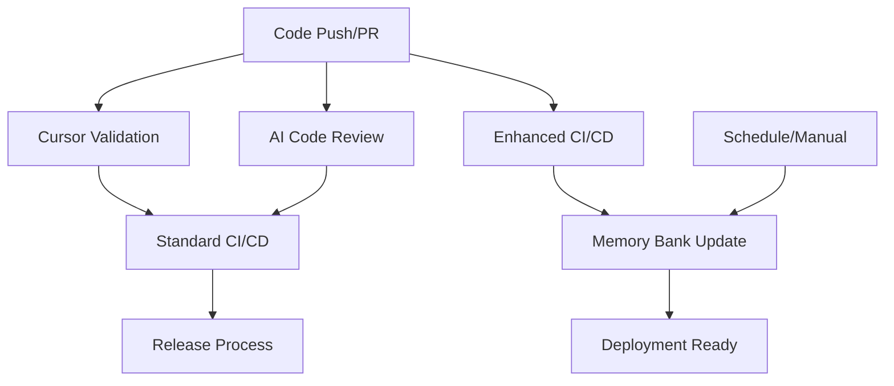

# GitHub Workflows for Cursor-Enhanced Development

## 🎯 **Overview**

This directory contains GitHub Actions workflows specifically optimized for the Cursor IDE development environment. These workflows leverage the AI-powered development setup, specialized agents, MCP servers, and memory bank system to provide intelligent CI/CD automation.

## 📋 **Workflow Inventory**

### **Core CI/CD Workflows**

#### 1. **Ctrl-Alt-Play Panel CI/CD Pipeline** (`ci.yml`)
*Original comprehensive CI/CD pipeline*
- **Purpose**: Standard testing, building, and deployment
- **Triggers**: Push to main/develop, pull requests
- **Features**: Multi-database testing, Docker builds, security scans
- **Matrix Testing**: Node.js 18/20, unit/integration tests

#### 2. **Create Release** (`release.yml`) 
*Automated release management*
- **Purpose**: Automated release creation with changelog extraction
- **Triggers**: Git tags (v*)
- **Features**: Automated release notes, artifact publishing
- **Dependencies**: Complete test suite and build validation

### **Cursor-Specific Workflows**

#### 3. **Cursor Configuration Validation** (`cursor-validation.yml`) 🆕
*Validates all Cursor IDE configurations*
- **Purpose**: Ensure Cursor setup is valid and functional
- **Triggers**: Changes to `.cursor/` or `memory-bank/` directories
- **Validation Checks**:
  - ✅ MCP server configuration (12 servers)
  - ✅ Custom modes structure (10 AI agents)
  - ✅ Rules system integrity (7 rule categories)
  - ✅ Memory bank completeness (6 core files)
  - ✅ TypeScript strict mode compliance
  - ✅ Project structure validation

#### 4. **AI-Powered Code Review** (`ai-code-review.yml`) 🆕
*Intelligent code review with AI assistance*
- **Purpose**: Automated code quality and architecture review
- **Triggers**: Pull requests, manual dispatch
- **AI Analysis**:
  - 🔍 TypeScript-only policy enforcement
  - 🏗️ Panel+Agent architecture compliance
  - 🔒 Security pattern analysis
  - 🧪 Test coverage recommendations
  - 🔌 Plugin system review
  - 📊 Change impact analysis
- **Features**: Automated PR comments, detailed analysis reports

#### 5. **Memory Bank Auto-Update** (`memory-bank-update.yml`) 🆕
*Maintains AI context through automated memory bank updates*
- **Purpose**: Keep memory bank current with project evolution
- **Triggers**: Code changes, weekly schedule, manual dispatch
- **Auto-Updates**:
  - 📝 Active context tracking
  - 📈 Progress metrics update
  - ⚙️ Technology stack changes
  - 🏗️ Architectural decision logging
  - 🔍 Dependency version tracking
- **Features**: Intelligent change detection, automated commits

#### 6. **Cursor-Enhanced CI/CD Pipeline** (`cursor-enhanced-ci.yml`) 🆕
*Next-generation CI/CD leveraging Cursor AI capabilities*
- **Purpose**: AI-assisted testing and quality assurance
- **Features**:
  - 🎯 Cursor configuration pre-flight checks
  - 🤖 AI-powered code quality analysis
  - 📋 Cursor rules validation testing
  - 🧠 Memory bank consistency checking
  - 🏗️ Architecture compliance verification
  - 🐳 AI-optimized Docker builds
  - 🚀 Deployment readiness assessment

## 🔄 **Workflow Integration**

### **Trigger Relationships**


### **Quality Gates**
1. **Pre-flight**: Cursor configuration validation
2. **Analysis**: AI-powered code review and quality analysis
3. **Testing**: Enhanced testing with Cursor rules validation
4. **Building**: Docker builds with security scanning
5. **Context**: Memory bank updates for AI assistance
6. **Deployment**: Readiness verification and promotion

## 🎨 **AI-Enhanced Features**

### **Specialized AI Agents Integration**
- **System Architect**: Architecture compliance checking
- **TypeScript Expert**: Type safety and code quality validation
- **Security Auditor**: Security pattern analysis and vulnerability detection
- **DevOps Specialist**: Deployment and infrastructure validation
- **Testing Engineer**: Test coverage and quality assessment

### **MCP Server Utilization**
- **GitHub MCP**: Repository management and PR automation
- **Docker MCP**: Container management and optimization
- **Memory MCP**: Persistent context for AI assistance
- **Git MCP**: Advanced version control operations
- **Context7**: Real-time documentation for code review

### **Memory Bank Intelligence**
- **Project Context**: Business goals and technical overview
- **Active Context**: Current development focus and priorities
- **System Patterns**: Architecture decisions and design patterns
- **Tech Context**: Technology stack and constraints
- **Progress Tracking**: Metrics and completed features
- **Decision Log**: Architectural decisions with rationale

## 📊 **Workflow Metrics & Monitoring**

### **Performance Targets**
- **Cursor Validation**: <2 minutes
- **AI Code Review**: <5 minutes
- **Enhanced CI/CD**: <15 minutes
- **Memory Bank Update**: <3 minutes
- **Standard CI/CD**: <20 minutes

### **Quality Metrics**
- **TypeScript Coverage**: 100% (no .js files)
- **Test Coverage**: >90% target
- **Security Scan**: Zero critical/high vulnerabilities
- **Architecture Compliance**: Panel+Agent separation maintained
- **Memory Bank Freshness**: <30 days for core files

### **AI Assistance Metrics**
- **MCP Servers Active**: 12/12 configured
- **Custom Modes Available**: 10 specialized agents
- **Rules Applied**: 7 categories with auto-enforcement
- **Memory Bank Files**: 6 core context files maintained

## 🛠️ **Configuration Requirements**

### **Repository Secrets**
- `GITHUB_TOKEN`: Automated PR comments and releases (auto-provided)
- Additional secrets for production deployments as needed

### **Required Files**
- `.cursor/mcp.json`: MCP server configurations
- `.cursor/modes.json`: Custom AI mode definitions
- `.cursor/rules/`: Rule system directory structure
- `memory-bank/`: Memory bank context files
- `docker-compose.yml`: Container orchestration
- `package.json`: Node.js project configuration

### **Optional Configuration**
- `.env.test`: Test environment variables
- `docker-compose.test.yml`: Test-specific container setup
- Custom workflow triggers and scheduling

## 🚀 **Usage Examples**

### **Triggering AI Code Review**
```bash
# Automatic on PR creation
git checkout -b feature/new-enhancement
git push origin feature/new-enhancement
# Creates PR → triggers ai-code-review.yml

# Manual trigger for specific PR
gh workflow run ai-code-review.yml -f pr_number=123
```

### **Forcing Memory Bank Update**
```bash
# Manual trigger with force refresh
gh workflow run memory-bank-update.yml -f force_update=true
```

### **Checking Cursor Configuration**
```bash
# Automatic on Cursor config changes
git add .cursor/
git commit -m "Update Cursor configuration"
git push
# Triggers cursor-validation.yml
```

## 🔧 **Customization Guide**

### **Adding New AI Analysis**
1. Edit `ai-code-review.yml`
2. Add new analysis steps in the appropriate job
3. Update the AI review summary generation
4. Test with a sample PR

### **Extending Memory Bank Updates**
1. Modify `memory-bank-update.yml`
2. Add new trigger conditions or update logic
3. Include new memory bank files as needed
4. Ensure proper validation steps

### **Enhancing Cursor Validation**
1. Update `cursor-validation.yml`
2. Add new MCP servers or custom modes to validation
3. Include additional rule system checks
4. Update configuration report generation

## 📈 **Future Enhancements**

### **Planned Improvements**
- **Background Agents Integration**: Leverage Cursor's background agents for complex tasks
- **Advanced AI Analysis**: Enhanced code pattern recognition and suggestions
- **Deployment Automation**: Full CI/CD integration with staging/production
- **Performance Monitoring**: Real-time metrics and alerting integration
- **Security Automation**: Advanced vulnerability scanning and remediation

### **Integration Opportunities**
- **Slack Notifications**: Workflow status updates
- **Jira Integration**: Issue tracking and project management
- **Monitoring Integration**: APM and logging system connections
- **Documentation Automation**: Auto-generated API docs and guides

---

*This workflow system represents a cutting-edge approach to AI-assisted software development, specifically optimized for the Ctrl-Alt-Play Panel's Panel+Agent architecture and TypeScript-first development methodology.*