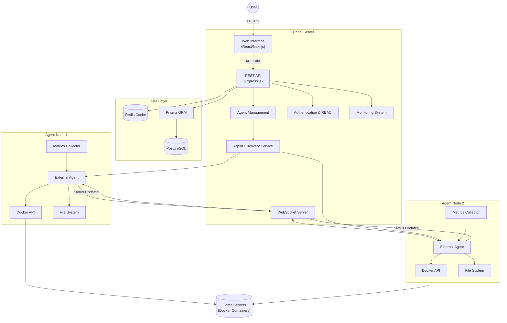

# Comprehensive Project Report: Ctrl-Alt-Play Panel

**Version: 1.0 | Date: July 25, 2025**

---

## Executive Brief

This comprehensive report analyzes the Ctrl-Alt-Play Panel, a mature, enterprise-grade game server management platform built as an alternative to Pterodactyl Panel. The project employs a distributed Panel+Agent architecture that separates central management from execution nodes, enabling improved scalability, fault isolation, and flexibility.

> **Key findings include:**
> - The project has successfully evolved from a monolithic system to a distributed architecture
> - Implementation of enterprise-grade security with 36 granular permissions across 10 categories
> - Robust technical foundation with TypeScript, React/Next.js, PostgreSQL, and Docker
> - Current development focus on completing external agent integration
> - Clear roadmap for future development with short, medium, and long-term recommendations

The Ctrl-Alt-Play Panel demonstrates high technical maturity with well-organized code, comprehensive documentation, and advanced security features, positioning it as a robust solution for game server management.

---

## Table of Contents
- [Comprehensive Project Report: Ctrl-Alt-Play Panel](#comprehensive-project-report-ctrl-alt-play-panel)
  - [Executive Brief](#executive-brief)
  - [Table of Contents](#table-of-contents)
  - [Executive Summary](#executive-summary)
    - [Purpose and Vision](#purpose-and-vision)
    - [Current State](#current-state)
  - [Project Architecture](#project-architecture)
    - [Panel+Agent Distributed Architecture](#panelagent-distributed-architecture)
    - [Communication Protocol](#communication-protocol)
    - [Key Architectural Characteristics](#key-architectural-characteristics)
    - [System Components](#system-components)
    - [Architecture Diagram](#architecture-diagram)
  - [Development Status](#development-status)
    - [Completed Features](#completed-features)
      - [Authentication \& Security](#authentication--security)
      - [Frontend](#frontend)
      - [Backend Infrastructure](#backend-infrastructure)
      - [Deployment](#deployment)
      - [Project Organization](#project-organization)
    - [In Progress](#in-progress)
      - [External Agent Integration](#external-agent-integration)
      - [Monitoring System](#monitoring-system)
      - [Game Server Management](#game-server-management)
    - [Development Milestones](#development-milestones)
  - [Technical Implementation](#technical-implementation)
    - [Security Implementation](#security-implementation)
      - [Authentication System](#authentication-system)
      - [Role-Based Access Control (RBAC)](#role-based-access-control-rbac)
      - [Security Monitoring](#security-monitoring)
      - [API Security](#api-security)
    - [Database Design](#database-design)
      - [Schema Design](#schema-design)
      - [Key Models](#key-models)
      - [Data Access Layer](#data-access-layer)
    - [API Design](#api-design)
      - [API Architecture](#api-architecture)
      - [Key API Areas](#key-api-areas)
      - [API Implementation](#api-implementation)
    - [Frontend Implementation](#frontend-implementation)
      - [Technology Stack](#technology-stack)
      - [Key Frontend Features](#key-frontend-features)
  - [Development Roadmap](#development-roadmap)
    - [Current Development Focus](#current-development-focus)
    - [Phased Development Plan](#phased-development-plan)
      - [Phase 1: Core Functionality Enhancement (Near-term)](#phase-1-core-functionality-enhancement-near-term)
      - [Phase 2: Advanced Features (Mid-term)](#phase-2-advanced-features-mid-term)
      - [Phase 3: Enterprise Features (Long-term)](#phase-3-enterprise-features-long-term)
    - [Technical Debt \& Improvements](#technical-debt--improvements)
    - [Game Support Roadmap](#game-support-roadmap)
    - [GitHub Projects Migration](#github-projects-migration)
  - [Strengths and Notable Features](#strengths-and-notable-features)
    - [Architectural Strengths](#architectural-strengths)
    - [Notable Features](#notable-features)
  - [Recommendations](#recommendations)
    - [Short-term Recommendations (1-3 months)](#short-term-recommendations-1-3-months)
    - [Medium-term Recommendations (3-6 months)](#medium-term-recommendations-3-6-months)
    - [Long-term Recommendations (6+ months)](#long-term-recommendations-6-months)
    - [Strategic Recommendations](#strategic-recommendations)
  - [Conclusion](#conclusion)

---

## Executive Summary

The Ctrl-Alt-Play Panel is a modern, enterprise-grade game server management platform designed as an alternative to Pterodactyl Panel. It features a distributed Panel+Agent architecture that provides comprehensive control and monitoring capabilities for game server administrators. The project has successfully evolved from a monolithic system to a more scalable and maintainable distributed architecture.

### Purpose and Vision

Ctrl-Alt-Play Panel aims to deliver a secure, scalable, and user-friendly solution for managing multiple game servers across distributed infrastructure. The platform prioritizes security, performance, and extensibility, offering features such as real-time monitoring, comprehensive server management, and advanced permission controls.

### Current State

The project is in a mature, production-ready state with version 1.0.3 currently deployed. It has successfully completed a major architectural transformation from a monolithic system to a Panel+Agent distributed architecture. Key milestones include:

- Complete implementation of the Panel+Agent distributed system
- Migration from static HTML to a modern React/Next.js frontend
- Implementation of a comprehensive Role-Based Access Control (RBAC) system with 36 granular permissions
- Development of external agent integration for improved scalability
- Establishment of a professional development workflow with semantic versioning and CI/CD

Current development focus is on:
- Console integration with external agents
- File management via external agents
- Real-time WebSocket communication replacement
- Configuration deployment through agents

The project demonstrates a high level of technical maturity with well-organized code, comprehensive documentation, and enterprise-grade security features.

---

## Project Architecture

The Ctrl-Alt-Play Panel employs a modern, distributed architecture that separates concerns between the central management panel and external agents. This design represents a significant architectural evolution from the project's original monolithic approach.

### Panel+Agent Distributed Architecture

The system follows a distributed Panel+Agent pattern similar to Pelican Panel/Wings, consisting of two primary components:

1. **Panel (Central Management)**:
   - Serves as the web interface and API backend
   - Handles user management, authentication, and authorization
   - Manages server configurations and settings
   - Coordinates communication with distributed agents
   - Aggregates monitoring data and metrics
   - Provides the administrative dashboard

2. **External Agents (Node Execution)**:
   - Run as separate projects on individual nodes/machines
   - Handle Docker container lifecycle management
   - Execute game server operations (start/stop/restart)
   - Perform file operations on the node
   - Collect and report metrics to the panel
   - Operate independently with fault tolerance

### Communication Protocol

The Panel and Agents communicate through:
- **HTTP REST API**: For standard operations and agent management
- **WebSocket**: For real-time events, console streaming, and status updates
- **JWT Authentication**: Secure communication with token-based auth
- **Agent Discovery**: Automatic detection and registration of agents

### Key Architectural Characteristics

- **Separation of Concerns**: Clear division between user interface/management (Panel) and execution (Agents)
- **Scalability**: Multiple agents can be deployed across different infrastructure
- **Reliability**: Agents can restart independently without affecting the panel
- **Security**: Authenticated communication with proper isolation
- **Flexibility**: Support for various agent implementations (Node.js, Go, Python, etc.)
- **Fault Tolerance**: Graceful handling of agent disconnections and failures

### System Components

The architecture consists of several key components:

- **Panel Server**: Node.js/Express application with TypeScript
- **Database Layer**: PostgreSQL with Prisma ORM
- **Frontend**: React/Next.js with static export
- **Agent Communication**: ExternalAgentService and AgentDiscoveryService
- **Security Layer**: JWT authentication with RBAC
- **Monitoring System**: Real-time metrics collection and visualization
- **File Management**: Remote file operations through agents
- **Console Access**: Real-time terminal access to game servers

This distributed architecture enables the system to scale horizontally, improve fault isolation, and provide better separation of concerns compared to the previous monolithic approach.

### Architecture Diagram

The diagram illustrates the distributed nature of the system, with the Panel Server handling the web interface, API, and coordination, while the External Agents manage Docker containers and file operations on their respective nodes. The WebSocket connection enables real-time communication between the Panel and Agents, while the REST API provides standard operations. The Agent Discovery Service allows for automatic detection and registration of agents across the infrastructure.

---

## Development Status

The Ctrl-Alt-Play Panel project is in a mature, production-ready state with version 1.0.3 currently deployed. The project has undergone significant development and has successfully implemented numerous features while maintaining a clear roadmap for future enhancements.

### Completed Features

#### Authentication & Security
- ✅ JWT-based authentication system with secure httpOnly cookies
- ✅ Role-based access control (USER, MODERATOR, ADMIN, ROOT_ADMIN)
- ✅ Advanced RBAC with 36 granular permissions across 10 categories
- ✅ Password hashing with bcrypt
- ✅ Security headers with Helmet
- ✅ HTTPS/SSL deployment with Let's Encrypt
- ✅ Content Security Policy (CSP)
- ✅ Rate limiting protection
- ✅ Comprehensive audit trails and security logging
- ✅ Session management with secure token rotation

#### Frontend
- ✅ React/Next.js application with static export
- ✅ TailwindCSS styling with custom theme
- ✅ Responsive design for all devices
- ✅ Glass morphism design system
- ✅ Server management interface
- ✅ Console and files page layouts
- ✅ Permission-aware UI with dynamic interface based on user permissions
- ✅ Real-time WebSocket integration for live updates

#### Backend Infrastructure
- ✅ Express.js server with TypeScript
- ✅ PostgreSQL database with Prisma ORM
- ✅ Redis cache integration
- ✅ WebSocket support for real-time features
- ✅ Comprehensive error handling
- ✅ Structured logging with Winston
- ✅ Health check endpoints
- ✅ Trust proxy configuration for nginx
- ✅ External agent communication framework

#### Deployment
- ✅ Docker containerization with multi-stage builds
- ✅ Docker Compose orchestration
- ✅ Nginx reverse proxy with SSL
- ✅ Production-ready configuration
- ✅ Automated database migrations
- ✅ Environment-based configuration
- ✅ SSL A-grade security rating
- ✅ Let's Encrypt certificate automation

#### Project Organization
- ✅ Complete project cleanup and file organization
- ✅ Comprehensive documentation suite
- ✅ Automation scripts (backup, update, monitor)
- ✅ Development workflow optimization
- ✅ Semantic versioning system with automated version management
- ✅ Professional contributing guidelines and security policy
- ✅ Automated GitHub Actions CI/CD pipeline
- ✅ Automated release creation and documentation

### In Progress

#### External Agent Integration
- ✅ Backend implementation of external agent communication
- ✅ Agent discovery service for automatic detection
- ✅ Agent management API endpoints
- ✅ Frontend integration with agent management dashboard
- 🔄 Console integration with external agents
- 🔄 File management via external agents
- 🔄 Real-time WebSocket communication replacement
- 🔄 Configuration deployment through agents

#### Monitoring System
- ✅ Basic health check endpoint implemented
- ✅ Server metrics collection framework
- ✅ Database for storing metrics
- 🔄 Real-time dashboard visualization
- 🔄 Historical data charts

#### Game Server Management
- ✅ Basic server CRUD operations framework
- ✅ Server configuration management structure
- ✅ File management system framework
- 🔄 Server start/stop/restart controls via external agents
- 🔄 Real-time console access
- 🔄 File upload/download functionality

### Development Milestones

The project has achieved several significant milestones:

1. **Architectural Transformation**: Successfully migrated from a monolithic system to a Panel+Agent distributed architecture
2. **Frontend Migration**: Completed migration from static HTML to a modern React/Next.js frontend
3. **Security Implementation**: Implemented comprehensive RBAC system with 36 granular permissions
4. **External Agent Integration**: Refactored the panel to work with external agents as separate projects
5. **CI/CD Pipeline**: Established professional development workflow with automated testing and deployment

The current development focus is on completing the external agent integration, particularly for console access, file management, and configuration deployment. This represents the final phase of the architectural transformation to a fully distributed system.

---

## Technical Implementation

The Ctrl-Alt-Play Panel implements several sophisticated technical solutions to ensure security, scalability, and maintainability. This section details the key technical aspects of the implementation.

### Security Implementation

The project employs a multi-layered security approach with enterprise-grade features:

#### Authentication System
- **JWT-based Authentication**: Secure token-based authentication using JSON Web Tokens
- **HttpOnly Cookies**: Prevents client-side JavaScript access to authentication tokens
- **Token Rotation**: Regular rotation of authentication tokens to prevent replay attacks
- **Session Management**: Comprehensive tracking of user sessions with metadata
- **IP Tracking**: Monitoring of session origins for security auditing

#### Role-Based Access Control (RBAC)
- **36 Granular Permissions**: Across 10 categories for fine-grained access control
- **Role Hierarchy**: USER → MODERATOR → ADMIN with permission inheritance
- **Permission Service**: Centralized service with caching for efficient permission checks
- **Resource Ownership Validation**: Ensures users can only access their own resources
- **Dynamic UI**: Frontend components adapt based on user permissions

#### Security Monitoring
- **Comprehensive Audit Trails**: Logging of all security-relevant actions
- **Real-time Security Monitoring**: Automated threat detection and alerting
- **Rate Limiting**: Protection against brute force and abuse attempts
- **Security Headers**: Implementation of secure HTTP headers with Helmet
- **Content Security Policy**: Strict CSP to prevent XSS attacks

#### API Security
- **Input Validation**: Thorough validation of all API inputs
- **SQL Injection Prevention**: Use of Prisma ORM with parameterized queries
- **CSRF Protection**: Cross-Site Request Forgery prevention measures
- **CORS Configuration**: Strict Cross-Origin Resource Sharing policies
- **Secure Error Handling**: Prevents leakage of sensitive information

### Database Design

The project uses PostgreSQL with Prisma ORM for a type-safe database layer:

#### Schema Design
- **29 Database Models**: Comprehensive data model covering all aspects of the system
- **Relationship Management**: Proper foreign keys and cascading deletes
- **Migrations**: Version-controlled schema changes with Prisma migrations
- **Indexing**: Optimized database indexes for query performance
- **Constraints**: Data integrity enforced through database constraints

#### Key Models
- **User Model**: User accounts with role and permission associations
- **Server Model**: Game server configurations and status
- **Agent Model**: External agent registration and metadata
- **Permission Models**: RBAC implementation with roles and permissions
- **Ctrl/Alt Models**: Game configuration templates (similar to nests/eggs)
- **Monitoring Models**: Performance metrics and system status

#### Data Access Layer
- **Prisma ORM**: Type-safe database access with generated TypeScript types
- **Query Optimization**: Efficient database queries with relation loading
- **Connection Pooling**: Optimized database connection management
- **Caching Strategy**: Redis caching for frequently accessed data
- **Transaction Support**: ACID-compliant transactions for critical operations

### API Design

The project implements a comprehensive RESTful API with WebSocket support:

#### API Architecture
- **RESTful Endpoints**: Well-structured REST API following best practices
- **WebSocket Integration**: Real-time communication for live updates
- **Middleware Pipeline**: Request processing through authentication, authorization, and validation
- **Error Handling**: Consistent error responses with appropriate status codes
- **Rate Limiting**: API rate limiting to prevent abuse

#### Key API Areas
- **Authentication API**: Login, registration, and session management
- **Server Management API**: CRUD operations for game servers
- **Agent API**: External agent registration and communication
- **File Management API**: Remote file operations through agents
- **Monitoring API**: System metrics and performance data
- **User Management API**: User and permission administration
- **Workshop API**: Steam Workshop integration

#### API Implementation
- **Express.js Routes**: Modular route definitions with Express
- **Controller Pattern**: Separation of route handling and business logic
- **Service Layer**: Business logic encapsulated in service classes
- **TypeScript Interfaces**: Strong typing throughout the API
- **OpenAPI/Swagger**: API documentation with OpenAPI specification

### Frontend Implementation

The frontend is built with modern technologies for a responsive and secure user experience:

#### Technology Stack
- **React/Next.js**: Modern frontend framework with server-side rendering
- **TypeScript**: Type-safe JavaScript development
- **TailwindCSS**: Utility-first CSS framework for styling
- **Static Export**: Enhanced security through static file serving
- **Glass Morphism Design**: Modern UI with frosted glass aesthetic

#### Key Frontend Features
- **Permission-aware UI**: Dynamic interface based on user permissions
- **Real-time Updates**: WebSocket integration for live data
- **Responsive Design**: Mobile-friendly interface that adapts to all devices
- **Interactive Console**: Real-time terminal access to game servers
- **File Manager**: Intuitive interface for remote file operations
- **Dashboard**: Comprehensive monitoring and management interface

This technical implementation demonstrates a mature, production-ready system with enterprise-grade security, scalable database design, and comprehensive API architecture.

---

## Development Roadmap

The Ctrl-Alt-Play Panel project has a well-defined development roadmap organized into phases, with clear priorities and milestones. This roadmap is based on GitHub issues, pull requests, and project planning documents.

### Current Development Focus

The immediate development focus is on completing the external agent integration, which is the final step in the architectural transformation to a fully distributed system:

1. **Console Integration with External Agents**: Implementing real-time console access through external agents
2. **File Management via External Agents**: Enabling remote file operations through the agent system
3. **Real-time WebSocket Communication Replacement**: Enhancing the WebSocket protocol for agent communication
4. **Configuration Deployment through Agents**: Streamlining configuration management via agents

There is an active PR #32 for frontend external agent integration currently under review, which addresses the UI components needed for agent management.

### Phased Development Plan

The project follows a phased development approach with clear priorities:

#### Phase 1: Core Functionality Enhancement (Near-term)

1. **Complete Server Management**
   - Server creation wizard
   - Server start/stop/restart controls via external agents
   - Real-time server status monitoring
   - Server console access via WebSocket
   - File manager with upload/download
   - Configuration editor with validation
   - Backup/restore functionality

2. **Enhanced Monitoring**
   - Real-time system metrics dashboard
   - Server performance graphs
   - Alert system for critical events
   - Historical data visualization
   - Resource usage analytics
   - Player count tracking

3. **User Experience Improvements**
   - Guided onboarding flow
   - Interactive tutorials
   - Better error messages and validation
   - Loading states and animations
   - Keyboard shortcuts
   - Dark/light theme toggle

#### Phase 2: Advanced Features (Mid-term)

1. **Multi-Node Support**
   - Node management interface
   - Load balancing configuration
   - Cross-node server deployment
   - Centralized monitoring
   - Node health checks
   - Failover mechanisms

2. **Advanced Automation**
   - Scheduled tasks system
   - Auto-scaling policies
   - Backup automation
   - Update management
   - Performance optimization
   - Self-healing capabilities

3. **Plugin System**
   - Plugin architecture framework
   - Plugin marketplace
   - Custom plugin development tools
   - Third-party integrations
   - Game-specific plugins

#### Phase 3: Enterprise Features (Long-term)

1. **Advanced Security**
   - Two-factor authentication (2FA)
   - SSO integration (LDAP/OAuth)
   - Audit logging enhancements
   - IP whitelisting
   - Session management improvements
   - Security scanning

2. **Scalability & Performance**
   - Microservices architecture
   - Kubernetes deployment
   - CDN integration
   - Database clustering
   - Caching optimization
   - Performance monitoring

3. **Business Intelligence**
   - Advanced analytics dashboard
   - Custom reporting system
   - Cost management tools
   - Usage forecasting
   - Performance benchmarking
   - ROI tracking

### Technical Debt & Improvements

The project also maintains a list of technical improvements to address:

- Complete TypeScript migration for all components
- Implement comprehensive unit testing (target: 80% coverage)
- Add integration tests for critical workflows
- Optimize database queries and indexing
- Implement proper error boundaries in React
- Add API documentation with OpenAPI/Swagger

### Game Support Roadmap

The project plans to expand support for various game servers:

- Minecraft (Vanilla, Forge, Fabric)
- Counter-Strike 2
- Garry's Mod
- Rust
- ARK: Survival Evolved
- Valheim
- FiveM (GTA V)
- Palworld
- Project Zomboid

### GitHub Projects Migration

The project is in the process of migrating to GitHub Projects for improved issue tracking and project management. This includes:

- Creating a GitHub Project for "Frontend Migration - Security & Feature Completion"
- Setting up project fields and automation rules
- Creating issues from templates
- Configuring workflow automation

The development roadmap demonstrates a well-organized approach to project evolution, with a clear focus on completing the distributed architecture in the near term, followed by feature enhancements and enterprise capabilities in later phases.

---

## Strengths and Notable Features

The Ctrl-Alt-Play Panel project demonstrates several significant strengths and notable features that distinguish it as a mature, enterprise-grade game server management platform.

### Architectural Strengths

1. **Distributed Panel+Agent Architecture**
   - Clear separation of concerns between management (Panel) and execution (Agents)
   - Improved scalability through distributed deployment
   - Better fault isolation with independent components
   - Flexibility to implement agents in different languages/technologies

2. **Security-First Design**
   - Comprehensive RBAC with 36 granular permissions
   - JWT authentication with secure httpOnly cookies
   - Real-time security monitoring and alerting
   - Comprehensive audit trails for all actions
   - Resource ownership validation

3. **Modern Technology Stack**
   - TypeScript throughout for type safety
   - React/Next.js frontend with static export
   - PostgreSQL with Prisma ORM for type-safe database access
   - Docker containerization for consistent deployment
   - WebSocket integration for real-time features

4. **Scalable Infrastructure**
   - Multi-node support for distributed deployments
   - Agent auto-discovery for seamless node integration
   - Horizontal scaling capabilities
   - Efficient resource utilization
   - Containerized deployment with Docker

### Notable Features

1. **Advanced Permission System**
   - 36 granular permissions across 10 categories
   - Role hierarchy with inheritance (USER → MODERATOR → ADMIN)
   - Permission-aware UI components
   - Resource-level authorization
   - Comprehensive security logging

2. **Real-time Monitoring**
   - Live server metrics and status updates
   - WebSocket-based real-time communication
   - Historical data visualization
   - Performance analytics
   - Alert system for critical events

3. **External Agent Integration**
   - Automatic agent discovery and registration
   - Health monitoring for all connected agents
   - Command routing through external agents
   - Fault tolerance for agent disconnections
   - Support for various agent implementations

4. **Professional Development Workflow**
   - Semantic versioning with automated version management
   - Comprehensive CI/CD pipeline
   - Automated testing and quality assurance
   - Detailed documentation and contribution guidelines
   - GitHub Projects integration for issue tracking

5. **User Experience**
   - Glass morphism design with modern aesthetics
   - Responsive layout for all devices
   - Real-time updates without page refreshes
   - Intuitive server management interface
   - Interactive console access

6. **Comprehensive Documentation**
   - Detailed API documentation
   - Memory bank for institutional knowledge
   - Clear architectural documentation
   - Contributing guidelines and security policy
   - Deployment and configuration guides

These strengths and notable features demonstrate the project's maturity and readiness for production use. The combination of a distributed architecture, enterprise-grade security, modern technology stack, and professional development workflow positions the Ctrl-Alt-Play Panel as a robust alternative to existing game server management solutions.

---

## Recommendations

Based on the comprehensive analysis of the Ctrl-Alt-Play Panel project, the following recommendations are proposed to further enhance the platform's capabilities, maintainability, and market position:

### Short-term Recommendations (1-3 months)

1. **Complete External Agent Integration**
   - Prioritize the completion of console integration with external agents
   - Finalize file management via external agents
   - Implement real-time WebSocket communication replacement
   - Develop configuration deployment through agents
   - Merge PR #32 for frontend external agent integration after thorough review

2. **Enhance Test Coverage**
   - Implement comprehensive unit testing with a target of 80% coverage
   - Add integration tests for critical workflows, especially agent communication
   - Develop end-to-end tests for core user journeys
   - Implement automated UI testing for frontend components
   - Set up continuous testing in the CI/CD pipeline

3. **Improve Documentation**
   - Create comprehensive API documentation with OpenAPI/Swagger
   - Develop user guides and tutorials for administrators
   - Update developer documentation with agent implementation guidelines
   - Document database schema and relationships
   - Create deployment guides for various environments

4. **Address Technical Debt**
   - Complete TypeScript migration for all components
   - Optimize database queries and indexing
   - Implement proper error boundaries in React components
   - Refactor legacy code components
   - Standardize coding practices across the codebase

### Medium-term Recommendations (3-6 months)

1. **Implement Multi-Node Support**
   - Develop node management interface for multiple agent deployments
   - Implement load balancing configuration for distributed workloads
   - Create centralized monitoring for all nodes
   - Develop node health checks and alerting
   - Implement failover mechanisms for high availability

2. **Enhance User Experience**
   - Develop guided onboarding flow for new users
   - Create interactive tutorials for common tasks
   - Implement dark/light theme toggle
   - Add keyboard shortcuts for power users
   - Improve loading states and animations

3. **Expand Game Support**
   - Prioritize support for popular games (Minecraft, Counter-Strike 2)
   - Develop game-specific configuration templates
   - Implement mod management for supported games
   - Create game-specific monitoring dashboards
   - Add game version management and updates

4. **Improve Security Posture**
   - Implement regular security scanning
   - Conduct penetration testing
   - Add IP whitelisting for administrative access
   - Enhance session management
   - Develop security incident response procedures

### Long-term Recommendations (6+ months)

1. **Develop Plugin System**
   - Create plugin architecture framework
   - Develop plugin marketplace
   - Implement custom plugin development tools
   - Support third-party integrations
   - Build game-specific plugins

2. **Implement Advanced Enterprise Features**
   - Develop two-factor authentication (2FA)
   - Implement SSO integration (LDAP/OAuth)
   - Create advanced analytics dashboard
   - Develop custom reporting system
   - Implement cost management tools

3. **Explore Platform Expansion**
   - Develop mobile app (React Native) for monitoring
   - Create desktop app (Electron) for administrators
   - Build CLI tool for advanced users
   - Develop API client libraries for various languages
   - Implement Discord bot integration

4. **Consider Architectural Evolution**
   - Evaluate microservices architecture for specific components
   - Explore Kubernetes deployment for large-scale installations
   - Investigate CDN integration for global deployments
   - Consider database clustering for high-performance scenarios
   - Research edge computing options for latency-sensitive operations

### Strategic Recommendations

1. **Community Building**
   - Establish a community forum for users and developers
   - Create a Discord server for real-time support
   - Develop a contributor program for open-source contributions
   - Host regular webinars or live streams for feature demonstrations
   - Implement a feedback system for feature requests

2. **Performance Optimization**
   - Establish performance benchmarks and targets
   - Implement performance monitoring and alerting
   - Optimize frontend bundle size
   - Enhance database query performance
   - Implement caching strategies for frequently accessed data

3. **Competitive Differentiation**
   - Conduct market analysis of competing solutions
   - Identify and develop unique selling propositions
   - Create comparison documentation highlighting advantages
   - Focus marketing on security and scalability advantages
   - Develop case studies demonstrating successful deployments

These recommendations aim to build upon the project's strong foundation while addressing areas for improvement and expansion. By following this strategic roadmap, the Ctrl-Alt-Play Panel can continue to evolve as a leading solution for game server management.

---

## Conclusion

The Ctrl-Alt-Play Panel represents a significant achievement in game server management technology. Through its evolution from a monolithic system to a distributed Panel+Agent architecture, the project has demonstrated technical excellence and a commitment to modern software development practices.

The comprehensive analysis presented in this report highlights several key conclusions:

1. **Architectural Maturity**: The Panel+Agent distributed architecture provides a solid foundation for scalability, fault tolerance, and separation of concerns. This architectural approach positions the platform well for future growth and enterprise adoption.

2. **Security Excellence**: With its 36 granular permissions across 10 categories, comprehensive RBAC system, and multi-layered security approach, the platform demonstrates enterprise-grade security capabilities that exceed many competing solutions.

3. **Technical Robustness**: The implementation of TypeScript, React/Next.js, PostgreSQL with Prisma ORM, and Docker containerization showcases a modern, maintainable, and type-safe technology stack that supports long-term development.

4. **Clear Development Direction**: The well-defined roadmap with phased priorities demonstrates strategic planning and a clear vision for the platform's future, focusing first on completing the distributed architecture before expanding to advanced features.

5. **Production Readiness**: With version 1.0.3 deployed and numerous core features completed, the platform has reached a mature, production-ready state suitable for real-world deployment while maintaining active development.

The Ctrl-Alt-Play Panel is well-positioned to serve as a robust alternative to existing game server management solutions, particularly for organizations requiring enterprise-grade security, scalability, and customization capabilities. By following the recommendations outlined in this report, the project can further strengthen its market position and technical capabilities.

As the gaming industry continues to grow and evolve, platforms like Ctrl-Alt-Play Panel will play an increasingly important role in managing the infrastructure that powers online gaming experiences. The project's focus on security, scalability, and user experience aligns well with the industry's trajectory toward more sophisticated, distributed gaming environments.
